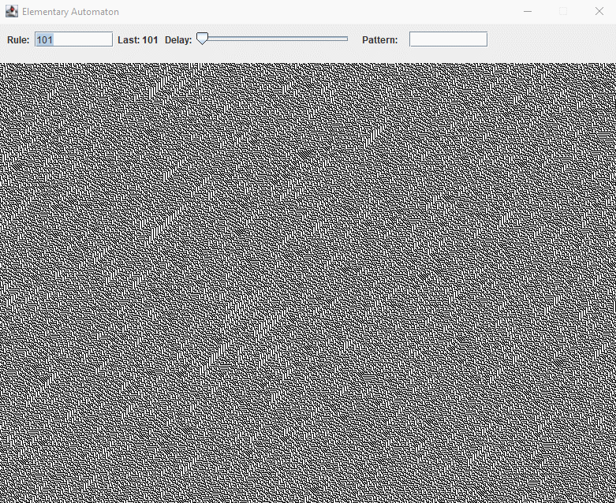

# Java 1-D cellular automata

## Usage

1. Compile and run program with Java.
2. Enter a rule $[0, 255]$ and press `Enter`.
3. Optionally:
    - Use slider to create a delayed animation
    - Enter any Pattern the first line should show. `[0,1]+`
      - e.g. `010` or `110110101`

## Background

An implementation of a 1-D cellular automata I did over 12 years back.
